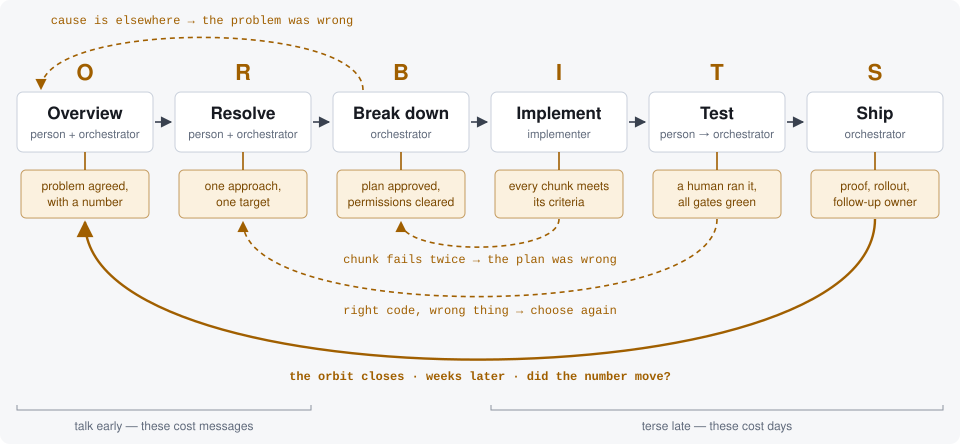

# The ORBITS Flow

**A working agreement for shipping software with agents.**

Six stages from a *measured problem* to a *verified fix*. Each one ends at a gate that a person
opens. Work does not move forward because it feels finished — it moves forward because the gate
opened.

> **O**verview · **R**esolve · **B**reak down · **I**mplement · **T**est · **S**hip

*Resolve* means resolving on a course of action, not resolving the ticket.

It is called ORBITS because the work comes back around: the follow-up filed at Ship re-enters
at Overview, carrying the number it was opened to check.

<p align="center">
  <picture>
    <source media="(prefers-color-scheme: dark)" srcset="docs/assets/orbits-flow-dark.svg">
    
  </picture>
</p>

**How to read it.** Work moves left to right, and only when the amber gate under each stage has
been opened by a person. Dashed arrows are work coming back to an earlier stage — normal, not a
failure — and every one of them lands on the cheap side, which is why the flow spends its
conversation early. The solid arrow is the orbit closing: weeks after Ship, the same query runs
again to find out whether the number actually moved.

📖 **[Read the full flow →](https://ahmedessameldeen.github.io/orbits/)**

---

## Three things hold it up

- **A fix is finished when the number moves, not when it merges.**
- **A person opens every gate** — or reviews them in one batch, on autopilot.
- **Agents write the code. Nothing leaves the machine without a person.**

## Install

In Claude Code or Cowork:

```
/plugin marketplace add ahmedessameldeen/orbits
/plugin install orbits-flow@orbits
```

That's it. The skill loads itself when it is relevant; the commands are available immediately.

## What you get

### Commands

| Command | What it does |
|---|---|
| `/orbits <ticket>` | Run work through the whole flow from the beginning, stopping at every gate |
| `/orbits-stage <name>` | Enter mid-flow at a named stage, for work already in progress |
| `/orbits-autopilot <ticket>` | Self-open and log the first four gates, hand back at Test |
| `/orbits-preflight` | Clear the permissions Implement needs — while leaving the sharp ones prompting |
| `/orbits-brief <chunk>` | Write a self-contained implementer brief for one chunk |
| `/orbits-check <ticket>` | Close the orbit — re-run the baseline query and find out if the number moved |

### Skill

`orbits` loads on its own when you pick up a bug, plan an approach, break work into chunks,
brief another agent, or ask whether something is ready to ship. It carries six reference
playbooks, read on entry to the stage that needs them rather than all at once:

`stages.md` · `metrics.md` · `autopilot.md` · `permissions.md` · `evidence.md` · `templates.md`

## The six gates

| Stage | Who drives | Gate |
|---|---|---|
| **Overview** | person + orchestrator | The problem is agreed, and it carries a number — trailing for a fix, leading for new work |
| **Resolve** | person + orchestrator | One approach chosen and the target metric agreed |
| **Break down** | orchestrator | The plan is approved and the permissions are cleared |
| **Implement** | implementer, chunk by chunk | Every chunk meets its criteria, then the full suite |
| **Test** | person, then orchestrator | A human exercised it in a real environment, all gates green from runs you performed yourself |
| **Ship** | orchestrator | PR with proof, rollout and revert threshold named, follow-up filed with an owner |

Every return path starts on the expensive side of the flow and lands on the cheap side. That is
the argument for spending real time in Overview and Resolve: those two stages cost messages,
and the stages they protect cost days.

## Closing the orbit

A merged pull request is a claim, not evidence. The evidence arrives weeks later, in the data.
This is the step almost every team skips, and it is the reason the flow is called ORBITS.

```
BASELINE  recorded at Overview
  metric      crash-free sessions on the checkout screen
  query       <the exact query — it has to be re-runnable>
  value       97.1%
  date        2026-09-01
  version     12.3

TARGET    agreed at Resolve
  target      above 99.5%
  check at    12.4, once adoption passes 40%
  failure     still below 98%, or crashes move to another screen

FOLLOW-UP filed at Ship
  claim       what this change was supposed to fix
  owner       a named person, not a team
  trigger     a condition — adoption threshold, error volume, a release tag
  links       the PR, the original ticket, the defect
  if not met  who to tell, and what the next move is
```

A follow-up that was never run is itself a finding. Report it as one — a flow that quietly
drops its own closing step is worse than one that never promised it.

Then `/orbits-check` re-runs the identical query. Three outcomes, all useful: it moved, it did
not move, or it moved and something else got worse.

## The run file

Everything the early stages produce — the baseline, the rejected options, the target, the
failure condition, the chunk list, which gates opened — lives in a conversation unless it is
written down, and that conversation will not survive the weeks between Ship and the follow-up.

So each run keeps a file, updated at every gate:

```
PROBLEM · KIND · BASELINE · TARGET · CHOSEN · REJECTED · METHOD · BLAST
CHUNKS · GATES · EVIDENCE · ROLLOUT · FOLLOW-UP
```

A run survives a lost session, changes hands without re-deriving anything, and closes weeks
later as a re-run of a recorded query rather than an archaeology exercise. The location is
negotiable; the existence is not.

## Works on more than mobile

The flow was written from mobile practice, but only the examples are mobile-shaped. The rule at
Test is that **a human exercises the change in a real environment before it ships** — what that
means depends on what you build:

| What you build | "In your hands" means |
|---|---|
| Mobile / desktop app | The build on a device, from an exact script |
| Web front end | The change in a browser, on the states it affects |
| Backend service | A real request against a running instance, response inspected |
| Library / SDK | A consumer project built against it |
| Data pipeline / infra | A dry run on real-shaped data, output diffed against current |

## Roles, not product names

Written so it survives a change of tooling. Map the roles onto whatever agents you actually
have; one agent can hold several. The only role that must never collapse into another is the
person — the gates exist to be opened by a human.

| Role | Does |
|---|---|
| Person | Opens every gate. Decides. Runs the app. |
| Orchestrator | Owns judgment. Plans, briefs, verifies, argues, lands. |
| Implementer | Writes code from a brief, in its own context. |
| Reviewer | Argues against the diff and the plan. |
| Analyst | Pulls the numbers — errors, complaints, funnels, adoption. |

## Autopilot

For when the approving is the slow part, not the deciding. Autopilot flies the cruise, not the
landing: it opens the first four gates itself, logs every decision with a reason and an undo,
and hands back at Test. Test needs a person holding a device; Ship sends work somewhere it
cannot be quietly retrieved from.

**A gate opened without a decision-log entry was skipped, not automated.**

## Repository layout

```
.claude-plugin/
  plugin.json          the plugin manifest
  marketplace.json     so the repo is its own marketplace
commands/              six slash commands
skills/orbits/
  SKILL.md             the flow, the roles, the rules
  references/          six playbooks, read on entry
docs/index.html        the full illustrated spec (GitHub Pages)
docs/assets/           the README diagram, light and dark
```

## License

MIT — see [LICENSE](LICENSE). Lift it, rename it, change the stages. It is a working
agreement, not a standard.
